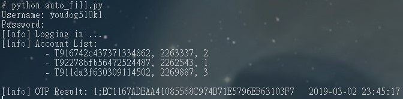

# BeanfunLogin
Auto get the one-time-password and fill in the username and password in the Maplestory client.

### Installation

```bash
pip3 install -r requirements.txt
```

### Usage

Press F1 ~ F5 in the homepage of the Maplestory client to login, where the keys are mapping to account-1 ~ account-5.

### Screenshot

